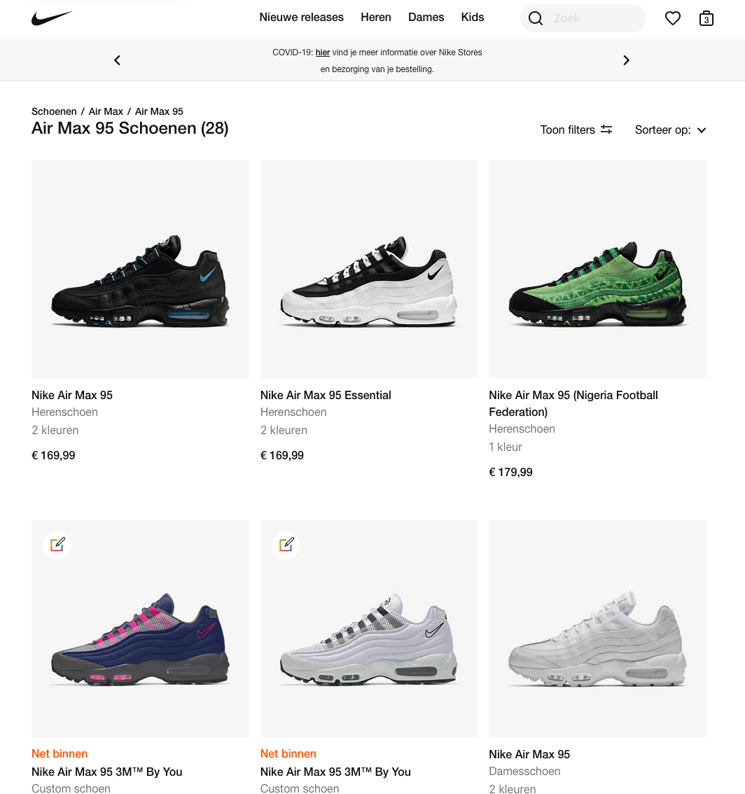
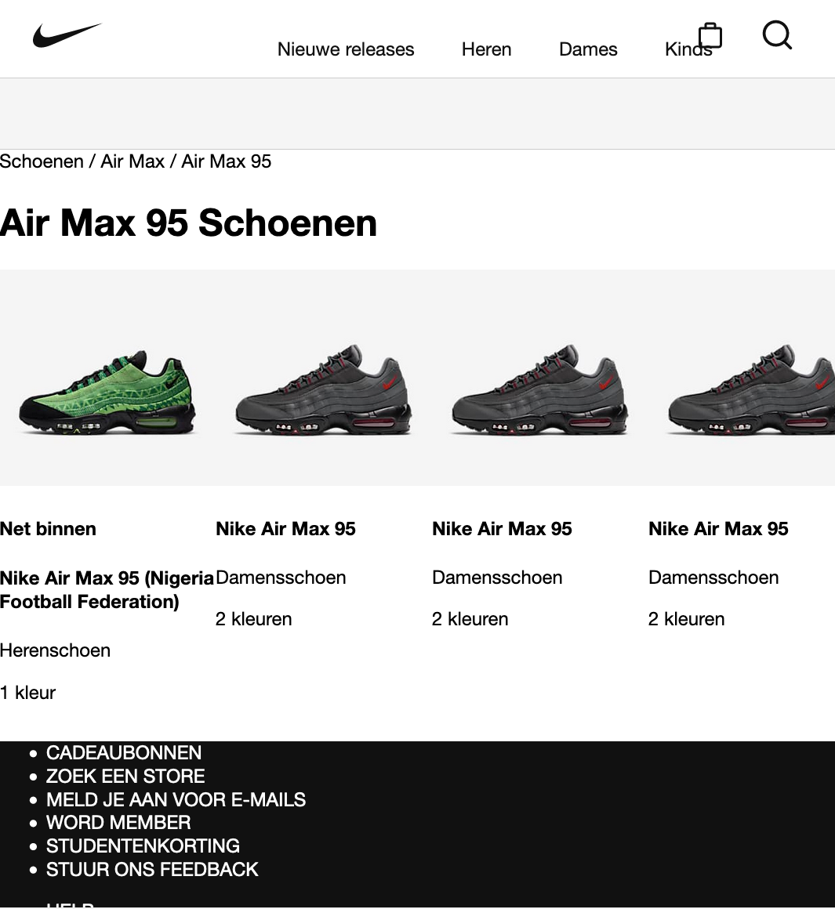
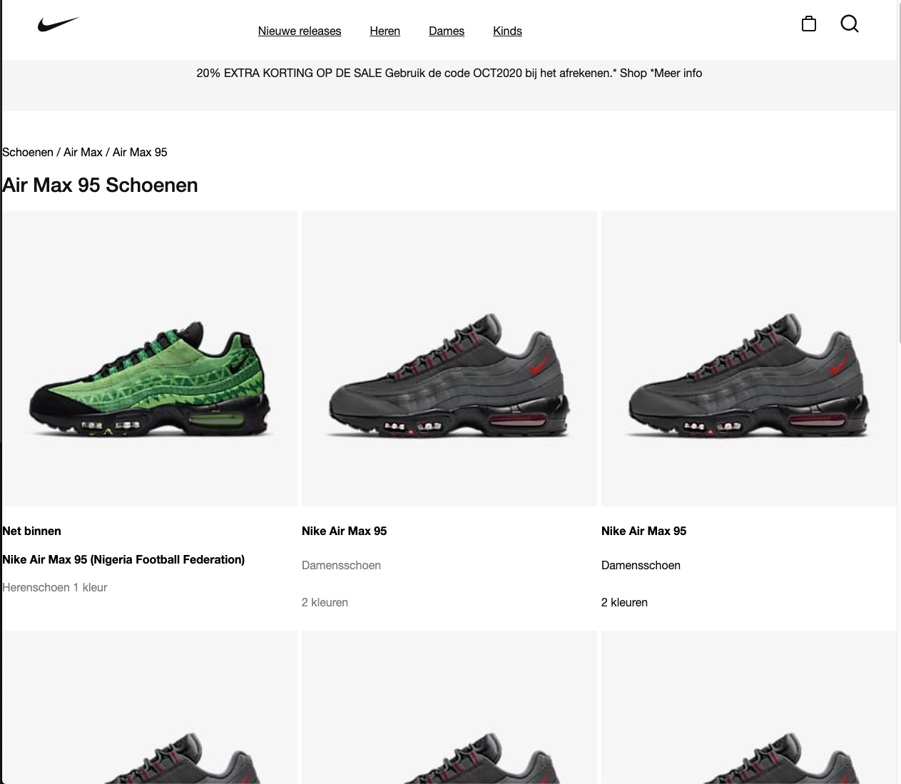
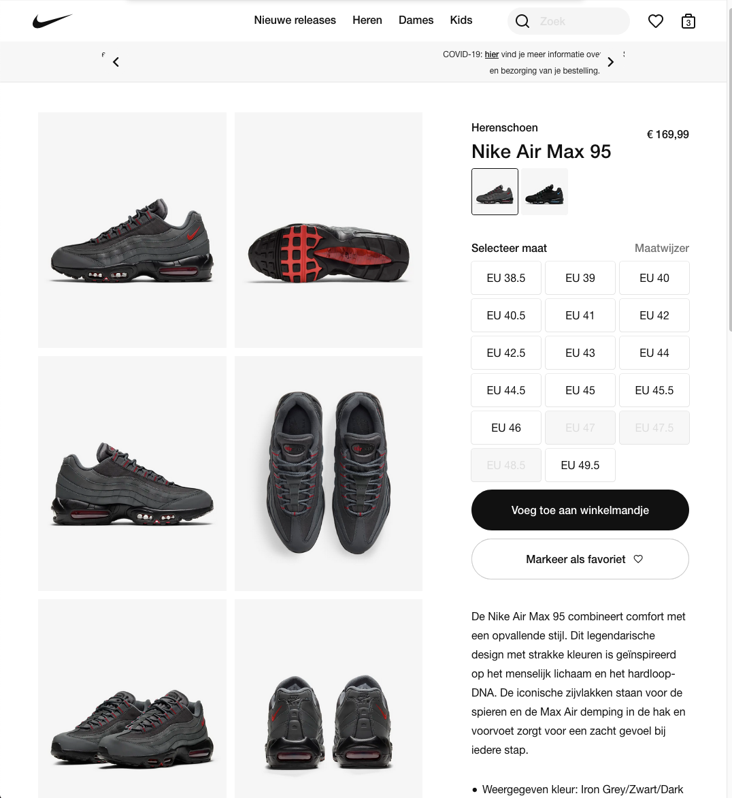

# Procesverslag
**Auteur:** -Matthijs Blauw-

Markdown cheat cheet: [Hulp bij het schrijven van Markdown](https://github.com/adam-p/markdown-here/wiki/Markdown-Cheatsheet). Nb. de standaardstructuur en de spartaanse opmaak zijn helemaal prima. Het gaat om de inhoud van je procesverslag. Besteedt de tijd voor pracht en praal aan je website.

## Bronnenlijst
1. -https://codepen.io/shooft/pen/LYNMeRd-
2. -https://codepen.io/shooft/pen/PoNQwXY-
3. -https://www.youtube.com/watch?v=jV8B24rSN5o-
4. Inconen allemaal van de website van nike

## Eindgesprek (week 7/8)

-dit ging goed & dit was lastig-
-ik had erg veel moeite met het maken van het slide in hamburger menu. Dit heeft heel veel onnodig tijd gekost. De detailpagina is bijna geworden als ik het wou. Op een computerscherm staat niet alles in het midden en dat is gewoon zonde. ik heb alles geprobeerd maar kwam er zelf niet uit (justify-content en items, align-content en items). maar toch ben ik blij met het eind resutaat.-

**Screenshot(s):**

## Voortgang 3 (week 6)
-Veel tips gekregen over de positionering van elementen. Daarnaast heb ik nog een aantal vragen gesteld over grid en animatie-

## Voortgang 2 (week 5)

-Dit gesprek heb ik gemist, omdat mijn oma in het ziekenhuis was opgenome-

## Voortgang 1 (week 3)

-Vooraf van het voortgangsgesprek had ik problemen met github, ik kon geen nieuwe bestanden uploaden. Daarnaast had ik besloten om opnieuwe te beginnen aangezien ik alles met flexbox had gedaan en dat niet de opdracht is-

### Stand van zaken

-Ik had verwacht dat dit vak goed te doen zou zijn, omdat ik html, css en JavaScrip vorig jaar de leukste vakken vond. Ik kwam er achterd dat dit vies tegenviel, doormiddel van de lange pauze met coderen was veel kennis gezakt. -
**Screenshot(s):**

-screenshot(s) van hoe ver je bent-

### Agenda voor meeting

-Samen met het groepje een programma opgesteld en samen aan de opdracht gewerkt.-

### Verslag van meeting

-na afloop snel uitkomsten vastleggen-

## Intake (week 1)

**Je startniveau:** -zwart(ga ervanuit dat dit het niveau is met de minste kennis)-

**Je focus:** -responsive-

**Je opdracht:** -https://www.nike.com/nl/t/air-max-95-herenschoen-0mhFQ0/DC4115-002-

**Screenshot(s):**

**Breakdown-schets(en):**

